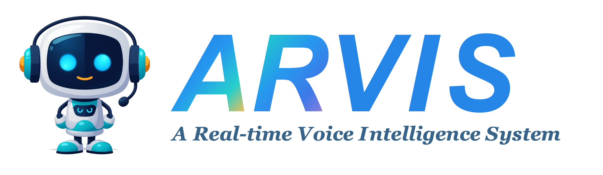

<p align="center">
  
</p>

## 项目介绍

· **ARVIS（A Real-time Voice Intelligence System）** 是一个面向自然对话与任务执行的开源实时语音智能系统。项目旨在让语音助手不仅能够“听懂再回答”，还能够在持续倾听中及时回应，处理对话中的插话、附和与打断，让人与 AI 的交流更接近日常交谈。

· **全双工语音交互**：让助手在说话的同时持续倾听，用户无需等待播报结束，就可以插话、补充或打断。当前采用级联式流程：麦克风采集音频，经 AEC3 回声抑制与本地唤醒门控后，进入语音活动检测（VAD）与流式语音识别（ASR），再由语言模型（LLM）生成回复，通过语音合成（TTS）流式播放；输入监听与输出播放并行运行，配合话轮控制协调双方发言。后续将推进端到端全双工模型训练，以 Qwen3 为语言骨干、Mimi 为音频编解码器，参考 Moshi 架构，探索直接对用户与助手音频流进行联合建模。

· **语义路由与话轮控制**：采用由 jev 训练的 **Qwen3-0.6B 意图识别模型**，结合助手已说出的内容与用户的实时转写，输出 `wait`（等待）、`continue`（继续说）、`yield`（让出话轮）等标签，为对话中的发言决策提供依据。相比仅凭音量或静音时长触发打断，语义路由关注用户“说了什么”，区分简短附和与真正的插话意图，让助手知道何时继续、何时等待、何时把话语权交还给用户。

· **语音驱动的 Agent 执行**：[Qwen Audio Agent](qwen-audio-agent/README.md) 连接实时对话与后台任务执行，可通过 **MCP** 接入 Computer Use 等工具，也可通过 **ACP 适配器**连接 Codex、Claude Code（CC）等 **Agent Harness**。用户可以用语音发起任务，在后台 Agent 执行期间继续交流、补充需求或查询进度，任务结果再返回当前对话，让语音助手从“回答问题”走向“执行任务”。

## Demo 展示

https://github.com/user-attachments/assets/39a33a28-4189-48f3-a419-51ceb4859e0b

https://github.com/user-attachments/assets/4e341571-aa07-4ddf-acd4-7b683fa5f7b8

## 安装与启动

下面以 **Apple Silicon macOS 14+** 为例，使用 **Paraformer + OpenAI 兼容 Chat Completions API + Qwen3-TTS** 启动语音服务端，再选择一种客户端连接。需要 Conda（Miniconda 或 Miniforge）、Python 3.12、Homebrew，以及可用的 LLM API 地址、模型名称和密钥。

**Linux + NVIDIA、Windows 和 WSL2** 的安装、CUDA、AEC3 及启动说明见[级联项目部署文档](cascaded-full-duplex/README.md#linux-与-windows-部署)。

### 1. 安装源码与依赖

首次下载项目并创建环境：

```bash
git clone https://github.com/GHJ20001017/Full-Duplex-Model.git
cd Full-Duplex-Model

# 系统库与构建工具单独安装，不属于 Python requirements
brew install portaudio ffmpeg meson ninja pkg-config
conda create -n speech_to_speech_system python=3.12 pip -y
conda activate speech_to_speech_system
python -m pip install -r requirements.txt
python -m pip check

cd cascaded-full-duplex

# 首次使用 macOS 开发工具时执行；已安装则跳过
xcode-select --install

# 等待开发工具安装完成后执行
./native/aec3/build_macos.sh
export S2S_AEC3_LIBRARY="$PWD/native/aec3/build/libs2s_aec3.dylib"

```

主环境不安装 openWakeWord：Linux 的 `tflite-runtime` 没有 CPython 3.12 wheel。下文原生客户端显式关闭唤醒门控；需要唤醒词时，按[独立 Python 3.11 客户端环境说明](cascaded-full-duplex/README.md#2-本地服务端唤醒词wake-word)安装 extra 和模型，不要在主环境直接运行唤醒词示例。该门控与服务端语义路由相互独立，主启动流程的 semantic 模式不变。

### 2. 启动语义路由服务

语义路由模型托管在 ModelScope：[ghjghj1017/qwen3-jev](https://www.modelscope.cn/models/ghjghj1017/qwen3-jev)，启动脚本位于 [`semantic-route-jev/deployment/`](semantic-route-jev/deployment/)。

新开一个终端，进入**本仓库根目录**并激活第 1 步创建的环境，然后下载模型到 `semantic-route-jev/checkpoint`：

```bash
conda activate speech_to_speech_system

python -c 'from modelscope import snapshot_download; snapshot_download("ghjghj1017/qwen3-jev", local_dir="semantic-route-jev/checkpoint")'
```

下载完成后，在同一个终端、仓库根目录启动服务。`CKPT` 是**本地模型目录**，不是 ModelScope 网页地址；如果模型已下载到其他位置，请替换该路径：

```bash
CKPT="$PWD/semantic-route-jev/checkpoint" \
  sh semantic-route-jev/deployment/start_inference_v7.sh
```

服务默认监听 `0.0.0.0:8792`。在第 3 步的语音服务端配置 `S2S_SEMANTIC_TURN_URL`，指向该服务的 `/v1/systemone` 接口；两个服务运行在同一台机器时，可使用 `http://127.0.0.1:8792/v1/systemone`。

### 3. 启动服务端

进入 `cascaded-full-duplex` 目录，先编辑 `scripts/start_voice_server.sh` 顶部的「本地配置」区：填写 API 密钥、LLM 基地址与模型名称，并确认语义路由 URL 和超时。`LLM_BASE_URL` 不要填写完整的 `/chat/completions` 路径。语义服务同机且未配置 TLS 时，URL 应改为 `http://127.0.0.1:8792/v1/systemone`。脚本会自动导出这些变量，无需每次手动 `export`；外部环境变量优先。**本地填入真实密钥后不要提交该文件**；共享或提交代码时，建议通过外部环境变量提供密钥，保留脚本中的占位值。

启动命令已集中到 [`scripts/start_voice_server.sh`](cascaded-full-duplex/scripts/start_voice_server.sh)，使用 Bash 执行。默认保留 **Paraformer（CPU）+ Chat Completions + Qwen3-TTS（CUDA/torch）**；TTS 默认需要 NVIDIA GPU，不适用于直接在 macOS 上执行。脚本不会安装依赖、下载模型或启动语义路由服务。

```bash
conda activate speech_to_speech_system

# 默认使用 Paraformer
bash scripts/start_voice_server.sh
```

**切换 Fun-ASR-Nano。** 根 requirements 已包含该后端依赖，脚本默认读取 `cascaded-full-duplex/hotwords.txt`，无需单独指定热词文件。通过以下参数指定已下载的本地模型目录（按实际位置替换）：

```bash
bash scripts/start_voice_server.sh \
  --stt fun-asr-nano \
  --fun_asr_nano_stt_model_name /gpu3/guhj/models/Fun-ASR-Nano-2512
```

### 4. 选择并启动客户端

项目提供两种客户端，连接第 2 步启动的同一个语音服务端，可按使用场景选择：

| 客户端 | 定位 | 主要能力 |
| --- | --- | --- |
| **S2S 修改版客户端** | 在 speech-to-speech 自带客户端基础上修改，适合直接语音对话与双工调试 | 本地麦克风／扬声器、AEC3 回声消除、`hey jarvis` 唤醒、对话窗口；打断行为由服务端控制 |
| **Qwen Audio Agent 客户端** | 带 Gateway 的语音 Agent 客户端与运行时，适合边对话边执行任务 | WebUI、TUI、桌面悬浮球，后台任务编排，以及 MCP 工具和 ACP Agent 接入 |

#### 3.1 S2S 修改版客户端

##### 启动客户端

新开终端二，进入**同一个** `cascaded-full-duplex` 目录，再执行：

```bash
conda activate speech_to_speech_system
export S2S_AEC3_LIBRARY="$PWD/native/aec3/build/libs2s_aec3.dylib"

speech-to-speech talk \
  --url ws://127.0.0.1:7869/v1/realtime \
  --wake-word ""
```

允许终端访问麦克风后直接开始对话（主环境不启用唤醒词）。客户端默认打开本地对话窗口；加 `--no-open-browser` 可只输出窗口地址而不自动打开浏览器，加 `--no-ui` 可只使用终端。服务端和客户端分别按 `Ctrl+C` 停止。

#### 3.2 Qwen Audio Agent 客户端

Qwen Audio Agent 通过自己的 Gateway 连接 S2S Realtime 接口，再向 WebUI、TUI 或桌面端提供对话与任务能力。**保留终端一的语音服务端运行**，不需要同时运行 `speech-to-speech talk`。

**安装与构建。** 需要 Node.js `^22.22.2`、`^24.15.0` 或 `>=26.0.0`，以及 npm 10+。新开终端二，从本仓库根目录进入已包含的源码快照，不必另行克隆上游仓库：

```bash
cd qwen-audio-agent
npm ci
npm run build
npm run cli -- config
```

最后一条命令会显示配置文件路径，并在缺失时创建模板；默认路径为 `~/.config/qwaudio/config.env`。打开该文件，将以下配置项设置为对应值（已有同名项时修改原值，不要重复追加）：

```dotenv
QWEN_AUDIO_REALTIME_PROVIDER=speech-to-speech
SPEECH_TO_SPEECH_REALTIME_URL=ws://127.0.0.1:7869/v1/realtime
AGENT_PROTOCOL=codex
QWEN_AUDIO_AGENT_BACKEND_PERMISSION_MODE=native
```

这里使用本项目的 **7869** 端口。语音模型和对话 LLM API 仍由终端一的 S2S 服务端配置，无需为本地 S2S 连接填写 DashScope 语音 API Key；后台任务交给 **Codex**，通过 `codex-acp` 适配器接入，并复用本机 `~/.codex` 中的配置、登录状态和模型。`native` 保留 Codex 自身的权限确认机制。

**安装并配置 Codex。** 在 `qwen-audio-agent` 目录执行：

```bash
# 补齐缺失的 Codex CLI 和 ACP 适配器，已有组件不会重复安装
npm run cli -- install codex

# 首次使用时登录；已配置好 Codex 认证的用户可跳过
codex login

# 检查 Codex 后端组件是否可用（不验证登录凭据）
npm run cli -- setup --backend codex
```

启动 Gateway 前，先确认本机 Codex 已完成认证并可正常使用；S2S 服务端的 LLM API 配置不能代替 Codex 的认证。自定义模型、接口或工作目录见 [Codex 配置](qwen-audio-agent/docs/backends/configuration.md#codex)。

**启动 Gateway。** 在终端二的 `qwen-audio-agent` 目录运行：

```bash
npm run gateway
```

**打开 WebUI。** 新开终端三，从本仓库根目录进入 `qwen-audio-agent`，运行：

```bash
cd qwen-audio-agent
npm run cli -- webui
```

在浏览器中允许麦克风访问并连接语音会话。若偏好终端界面，可将最后一条命令替换为 `npm run cli -- tui`；其音频依赖和平台限制见 [TUI 使用说明](qwen-audio-agent/docs/getting-started/tui.md)。

**桌面端可选。** 如需悬浮球界面，在完成上述源码安装和构建后，于 `qwen-audio-agent` 目录执行：

```bash
npm run desktop
```

桌面端内置 Gateway，是独立的启动方式，不必额外执行 `npm run gateway` 或打开 WebUI；切换前停止前述独立 Gateway、断开旧语音会话，在桌面设置中确认选择 Speech-to-Speech 及相同的 Realtime 地址。桌面端详情见 [桌面客户端说明](qwen-audio-agent/docs/desktop/overview.md)。

更多语音后端与服务端参数见 [级联服务文档](cascaded-full-duplex/README.md)；Qwen Audio Agent 的客户端、后台任务及工具配置见 [Qwen Audio Agent 文档](qwen-audio-agent/README.md)。

## 引用

级联路线基于 Hugging Face 的 [speech-to-speech](https://github.com/huggingface/speech-to-speech) 项目，使用或分发时请同时引用上游原项目；组件模型引用见 `cascaded-full-duplex/README.md`。

## ⚖️ 开源协议

本项目采用 Apache License 2.0 开源协议。
