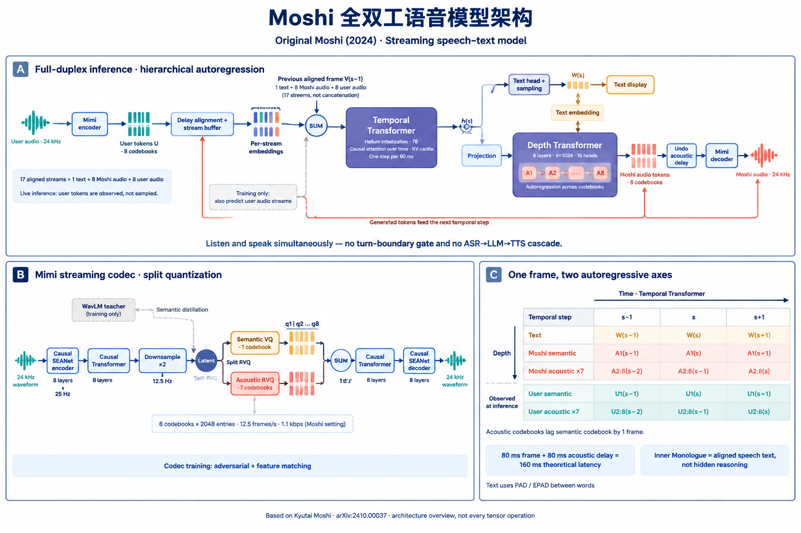

# 端到端全双工模型

本项目以 Qwen3 为语言骨干，结合 Mimi 音频编解码器，使用公开与仿真数据，复现 Moshi 的端到端全双工语音交互能力。

## Moshi 架构参考

[](docs/moshi-architecture-overview.png)

## Step1: 下载对应的模型文件

下载 **Qwen/Qwen3-1.7B**（非 Base 版）的权重、配置和 tokenizer，以及 **Mimi 音频编解码器**权重。Mimi 来自官方 `kyutai/moshiko-pytorch-bf16` 仓库，只下载 codec 文件，不下载 Moshi 7B 语言模型。

```bash
cd "/Users/guhj/Documents/Full-Duplex Model/end-to-end-full-duplex"
python3 -m pip install -U huggingface_hub
python3 scripts/download_models.py
```
