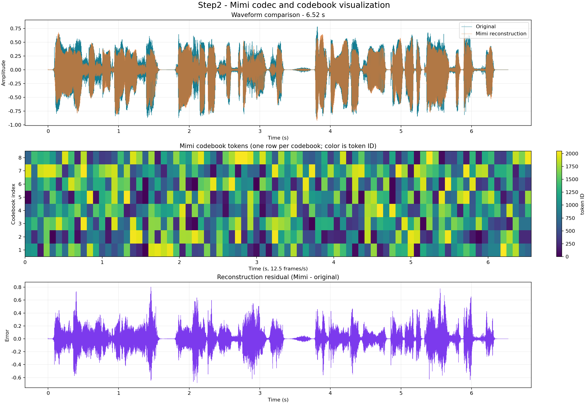
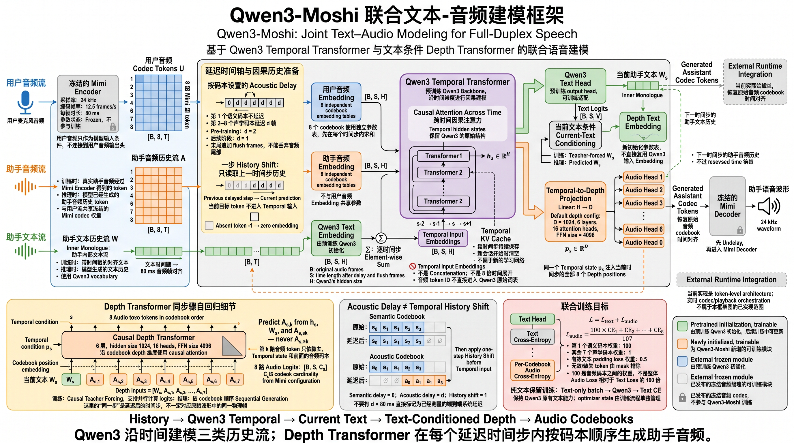

# 端到端全双工模型

本项目以 Qwen3 为语言骨干，结合 Mimi 音频编解码器，使用公开与仿真数据，复现 Moshi 的端到端全双工语音交互能力。

## Moshi 架构参考

[](assert/moshi-architecture-overview.png)

## Step1: 下载对应的模型文件

通过 **ModelScope（魔搭）** 下载 [Qwen/Qwen3-1.7B](https://modelscope.cn/models/Qwen/Qwen3-1.7B)（非 Base 版）的权重、配置和 tokenizer，以及 **Mimi 音频编解码器**权重。Mimi 从 ModelScope 上的 [kyutai/moshiko-pytorch-bf16](https://modelscope.cn/models/kyutai/moshiko-pytorch-bf16) 仓库下载，仅获取 `tokenizer-e351c8d8-checkpoint125.safetensors`，不下载 Moshi 7B 语言模型。

```bash
cd "/Users/guhj/Documents/Full-Duplex_Model/end-to-end-full-duplex"
python3 -m pip install -U modelscope
python3 scripts/download_models.py
```

## Step2: 可视化 Mimi codebook 并检查音频重建

运行多个音频 case（不会下载模型，也不会修改原始音频）：

```bash
python3 scripts/visualize_mimi_codebooks.py \
  --mimi-checkpoint checkpoints/base/mimi/tokenizer-e351c8d8-checkpoint125.safetensors \
  --output-dir outputs/step2-codebooks \
  cases/example-01.wav cases/example-02.wav
```

### Step2 示例结果



- [原始音频 WAV](assert/ZH_B00000_S09981_W000013.wav)
- [Mimi 重建音频 WAV](assert/ZH_B00000_S09981_W000013.reconstructed.wav)

## Step3: 用 Qwen3 搭建 Moshi 联合模型框架

Step3 按路线文档第 1 步实现 Qwen3-Moshi 的可导入模型骨架：Qwen3 负责跨时间的 Temporal Transformer，独立的用户/助手 Mimi 音频 embedding 与 Qwen 文本 embedding 按时间步求和；文本 head 预测 Inner Monologue，Depth Transformer 在同一时间步按 8 个 Mimi codebook 自回归预测助手音频。Mimi 仍是外部冻结 codec，不在此模块中训练。

### Step3 架构图



代码位于 `models/qwen3_moshi.py`，包括：

- 从 Qwen3 config 读取 `hidden_size` 和 `vocab_size`，从 Mimi 配置传入 8 路 codebook cardinality；音频 token 不进入 Qwen3 原始词表；
- acoustic delay（pre-training 默认 2 帧，后续阶段可设为 1 帧）、独立 shift/mask、时间戳对齐和会话 `reset_stream_state()`；
- Temporal KV cache 接口、文本 head、Temporal→Depth 投影、因果 Depth Transformer 和 8 路音频 output heads；
- 文本 CE、8 路 audio CE、语义 codebook 加权 audio loss，以及 padding/无效帧 mask；
- `tests/test_qwen3_moshi.py` 中的小模型单元测试，不下载 Qwen3 或 Mimi 权重。

安装实际运行模型所需的 PyTorch 和 Transformers 后，可对本地 Qwen3 checkpoint 只做结构检查：

```bash
python3 -m pip install torch transformers
PYTHONPATH=. python3 scripts/inspect_qwen3_moshi.py \
  checkpoints/base/qwen3 \
  --local-files-only
```

## Step4: 第一阶段 Emilia 单流预训练

在 `end-to-end-full-duplex/` 目录运行以下命令，先用已有的 schema 2 Emilia 时间戳文件做 10 步小规模训练检查。将模型路径替换为实际位置，并先将环境变量 `TEXT_PAD_TOKEN_ID` 设为已确认的、Qwen 现有词表中的文本占位 token ID；脚本不会自动猜测或新增 token。

```bash
python -m trainer.train_stage1 \
  --manifest outputs/emilia-qwen-raw-smoke.jsonl \
  --qwen-model /absolute/path/to/qwen3-1.7b \
  --mimi-checkpoint /absolute/path/to/tokenizer-e351c8d8-checkpoint125.safetensors \
  --output-dir outputs/stage1-smoke \
  --cache-dir outputs/emilia-token-cache \
  --text-pad-token-id "${TEXT_PAD_TOKEN_ID:?请先设置文本占位token ID}" \
  --device cuda:0 \
  --precision bf16 \
  --gradient-checkpointing \
  --batch-size 1 \
  --max-samples 32 \
  --max-duration 10 \
  --max-steps 10 \
  --validation-interval 0 \
  --validation-fraction 0
```

该命令需要支持 bf16 的 CUDA 环境；Mimi 保持冻结，训练使用单路音频流。小样本检查显式关闭验证，避免同一来源的数据无法划出独立验证集；正式训练应使用完整时间戳文件，并启用按来源分组的验证划分。

训练输出为 `outputs/stage1-smoke/checkpoint.pt` 和 `metrics.jsonl`。断点恢复时保持原配置（尤其是 `--max-steps`）不变并追加 `--resume`；若需提前暂停，使用 `--stop-after-steps`，不要通过改变 `--max-steps` 模拟暂停。
